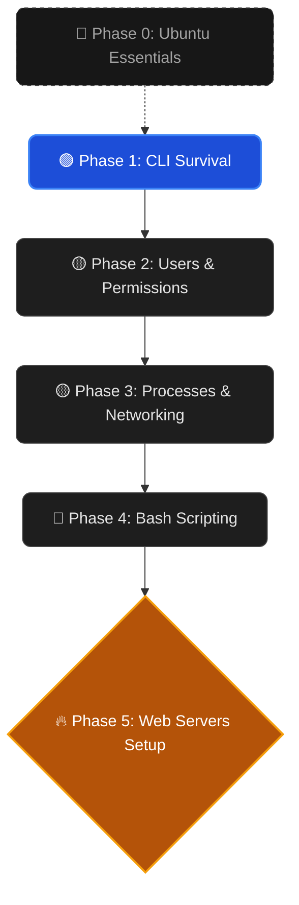

> [!INFO] 🎯 Mission Briefing
> **Target:** Master Linux CLI, Scripting, and Web Servers for Backend/DevOps Engineering.
> **Strategy:** Start with a light warm-up, then dive deep into modern tools (Systemd, modern networking). Skip legacy courses and deep storage administration.
> **Current Status:** 🚧 In Progress

tags: #linux #roadmap #backend #devops #systems

---

![[Gemini_Generated_Image_95wmaf95wmaf95wm.png]]

## 🌳 The Skill Tree

---

## 🎒 Curated Inventory

> [!WARNING] 🛑 Avoid Legacy Content
> Do not use outdated Linux courses. Linux has evolved significantly over the years (`systemd` replaced `init`, `ip` replaced `ifconfig`). Stick exclusively to the modern resources listed below.

### 🥇 Phase 0: The Warm-Up
A quick introduction to break the ice and set up your environment.

| Phase | Source | Topic Summary | Status |
| :--- | :--- | :--- | :---: |
| **0. Ubuntu Essentials** | [MaharaTech Course](https://maharatech.gov.eg/course/view.php?id=2155) | 6-Hour Crash Course for UI & Basic CLI. | ⏳ |

### 👑 The Main Track
This path is built entirely on the **TananyAcademy (2024)** course. Follow the exact video numbers below and skip the unnecessary System Admin parts.

| Phase | Videos | Topic Summary | Status |
| :--- | :--- | :--- | :---: |
| **1. CLI Survival** | [Videos 01 $\rightarrow$ 11](https://www.youtube.com/playlist?list=PLsWFuR2EEv1uIV2vzqAhSa8gI6IG9dMpc) | Navigation, paths, `cat`, `nano`, `mkdir`, `cp`, `mv`. | 🔒 |
| **2. Users & Perms** | [Videos 12 $\rightarrow$ 31](https://www.youtube.com/playlist?list=PLsWFuR2EEv1uIV2vzqAhSa8gI6IG9dMpc) | Users/Groups, `chmod`, `chown`, `grep`, `find`, Archiving. | 🔒 |
| **3. Core System** | [Videos 32 $\rightarrow$ 42](https://www.youtube.com/playlist?list=PLsWFuR2EEv1uIV2vzqAhSa8gI6IG9dMpc) | Processes (`top`, `kill`), `systemd`, Networking, Packages. | 🔒 |
| **4. Bash Scripting** | [Videos 54 $\rightarrow$ 65](https://www.youtube.com/playlist?list=PLsWFuR2EEv1uIV2vzqAhSa8gI6IG9dMpc) | Variables, `if/else`, loops, Cronjobs (Automation). | 🔒 |
| **5. Web Servers** | [Videos 69 $\rightarrow$ 72](https://www.youtube.com/playlist?list=PLsWFuR2EEv1uIV2vzqAhSa8gI6IG9dMpc) | Setup Apache & Nginx (Crucial for Backend). | 🔒 |

*Note: Skipped videos `43` to `53` (Advanced Storage: LVM/RAID) as they are intended for System Admins, not Developers.*

---

## 🛠️ Practical Labs & References

Linux is muscle memory. Use these resources to practice what you watch.

| Resource Name           | Type | Purpose                                                          | Link                                                       |
| :---------------------- | :--: | :--------------------------------------------------------------- | :--------------------------------------------------------- |
| **Linux Journey** |  📖  | Interactive text-based tutorials for quick syntax review.        | [Visit Site](https://linuxjourney.com/)                    |
| **OverTheWire: Bandit** |  🎮  | Wargame. Connect via SSH and solve puzzles using Linux commands. | [Play Bandit](https://overthewire.org/information/bandit/) |
| **Ahmed Samy** |  💊  | 11-Hour continuous video. Best used as a final review.           | [YouTube Link](https://youtu.be/gojeTqXdBH0)               |

---

## ⚡ Verification Checkpoints
Ensure you can complete these tasks without tutorials before moving to the next phase:

- [ ] **Phase 0:** Successfully installed Ubuntu (or a VM), navigated the desktop, and opened the terminal.
- [ ] **Phase 1:** Can navigate, create, move, and edit files purely from the terminal without touching the mouse.
- [ ] **Phase 2:** Can create a new user and restrict their access to a specific folder using `chmod 700`.
- [ ] **Phase 3:** Can find a frozen process, kill it, and install a new software package from the CLI.
- [ ] **Phase 4:** Wrote a Bash script that backs up a directory and scheduled it with `cron` to run daily.
- [ ] **Phase 5:** Successfully started an Nginx server and viewed the default page in the browser.